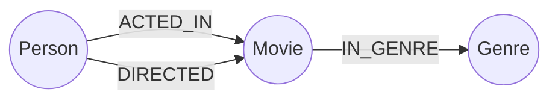

# GraphFlix — CognoDB Graph Explorer

A small, complete graph-backed movie discovery application built for the WEXA AI CognoDB take-home assignment.

## Use case

GraphFlix helps a user discover movies through **connections**: actors, directors and genres. Instead of treating each movie as an isolated row, the application traverses relationships to recommend connected movies and explore a second-hop neighborhood.

## Why a graph database?

The useful questions here are relationship-heavy: "Which movies are connected to this movie through shared actors?", "Which recommendations share both actors and genres?", and "What appears two hops away through the actor network?" In a relational schema these questions require multiple joins and intermediate result sets. In a graph model the relationship paths are explicit and Cypher expresses the traversal directly.

## Graph model



### Nodes
- `Movie(title, year, rating)`
- `Person(name)`
- `Genre(name)`

### Relationships
- `(:Person)-[:ACTED_IN]->(:Movie)`
- `(:Person)-[:DIRECTED]->(:Movie)`
- `(:Movie)-[:IN_GENRE]->(:Genre)`

## Requirements mapping

- Thoughtful graph model: included above.
- Realistic seed data: `data/movies.csv` and `scripts/seed.py`.
- Multi-hop traversal: `cypher/queries.cypher` and `/api/two-hop`.
- Relationally awkward query: shared actors + shared genres query.
- Parameterised Cypher: all application queries use driver parameters.
- Functional web application: Flask + responsive HTML/CSS/JS UI.
- Error handling: API returns a useful 503 when CognoDB is unreachable.
- Secrets: `.env` is ignored by Git; use `.env.example` as the template.

## Local setup

### 1. Create CognoDB

Create a free CognoDB instance and save the connection URI and generated password. The assignment specifies the URI form `bolt+s://<instance-id>.databases.cognodb.cloud` and username `cognodb`.

### 2. Create environment file

Copy `.env.example` to `.env` and fill in your real credentials:

```env
COGNODB_URI=bolt+s://YOUR-INSTANCE-ID.databases.cognodb.cloud
COGNODB_USER=cognodb
COGNODB_PASSWORD=YOUR_GENERATED_PASSWORD
```

Never commit `.env`.

### 3. Install

```bash
python -m venv .venv
# Windows
.venv\Scripts\activate
# macOS/Linux
# source .venv/bin/activate
pip install -r requirements.txt
```

### 4. Seed the graph

```bash
python scripts/seed.py
```

### 5. Run

```bash
python -m app.main
```

Open `http://localhost:5000`.

## Main queries

`app/queries.py` contains the application's parameterised Cypher.

1. **Search:** movie lookup by title.
2. **Details:** fetch connected actors, genres and directors.
3. **Recommendation:** `Movie -> Actor -> Movie`, scored by shared actors, shared genres and rating.
4. **Two-hop discovery:** `Movie -> Actor -> Movie -> Actor -> Movie`.
5. **Genre aggregation:** count movies and average rating per genre.

## Deployment

A free Render deployment can use the included `render.yaml`/`Procfile`.

1. Push this repository to GitHub.
2. Create a new Render Web Service from the repository.
3. Add `COGNODB_URI`, `COGNODB_USER=cognodb`, and `COGNODB_PASSWORD` as environment variables.
4. Deploy.
5. Seed CognoDB once from a machine that has access to the instance: `python scripts/seed.py`.
6. Verify the hosted URL and `/api/health`.

## Demo checklist

Before submission:

- [ ] CognoDB instance is running.
- [ ] Seed script completed successfully.
- [ ] Search works.
- [ ] Movie details work.
- [ ] Recommendations work.
- [ ] Two-hop discovery works.
- [ ] Error state works when database is unavailable.
- [ ] Hosted demo works.
- [ ] Add final UI screenshots to this README.
- [ ] Record a short screen demo.
- [ ] Push all source code to GitHub.

## Suggested demo flow

1. Open the hosted application.
2. Search `Inception`.
3. Open the movie card.
4. Show connected actors and genres.
5. Show recommendations from graph relationships.
6. Explain the two-hop results.
7. Briefly show the graph model and GitHub repository.

## License

Created for the WEXA AI candidate take-home assignment.
